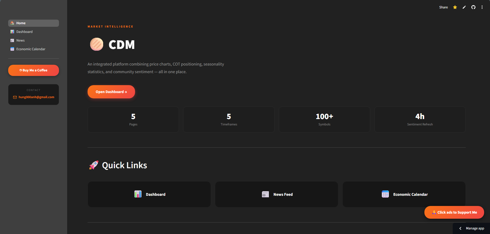
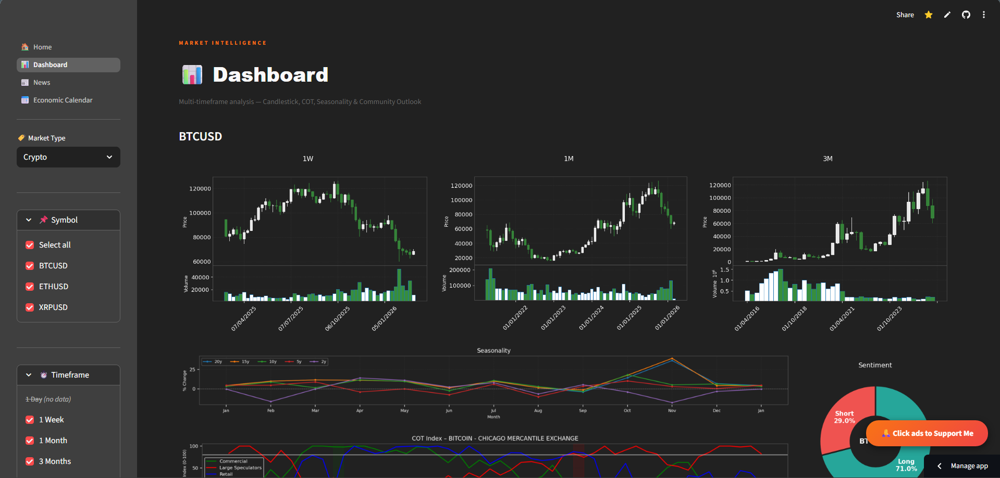
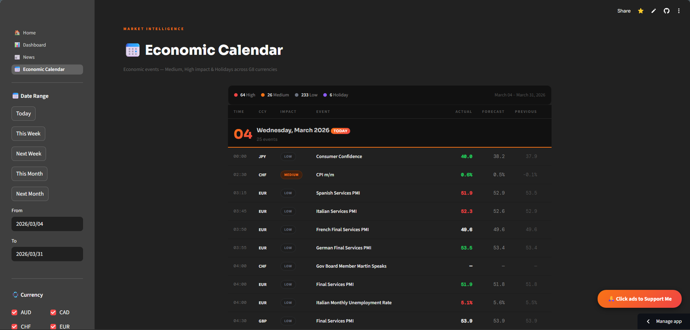

<div align="center">


# 🫓 CDM — Currency Data & Market Intelligence

**An integrated platform combining price charts, COT positioning, seasonality statistics, community sentiment, economic calendar, and financial news — all in one place.**

[](https://streamlit.io)
[](https://python.org)
[](https://supabase.com)
[](LICENSE)

[🌐 Live Demo](https://cudomarket.streamlit.app/) &nbsp;·&nbsp; [📬 Contact](mailto:hung000anh@gmail.com) &nbsp;·&nbsp; [☕ Support](https://buymeacoffee.com/hung000anh)

</div>

---

## 📸 Screenshots

### 🏠 Home
> Overview page with quick navigation, core features, data coverage, and roadmap.



---

### 📊 Dashboard
> Multi-timeframe analysis — Candlestick charts, COT positioning, Seasonality, and Community Outlook in one view.



---

### 📰 News Feed
> Financial & economic news across G8 markets with country, keyword, and date range filters.


---

### 📅 Economic Calendar
> High and medium impact events, holidays across G8 currencies with actual vs forecast color-coded results.



---

## ✨ Features

| Feature | Description |
|---|---|
| 📈 **Candlestick & Volume** | Multi-timeframe OHLCV charts with swing high/low markers and moving averages |
| 📋 **COT Positioning** | COT Index (0–100) for Commercials, Large Speculators, and Retail with extreme zone highlights |
| 🌊 **Seasonality** | Monthly average % change over 2y, 5y, 10y, 15y, 20y lookback periods |
| 🧭 **Community Sentiment** | Long/Short % from Myfxbook community outlook, refreshed every 4 hours |
| 📅 **Economic Calendar** | High/medium impact events and holidays across G8 currencies |
| 📰 **News Feed** | Financial news filterable by country, keyword, and date range |

---

## 🗂️ Project Structure

```
CDM/
├── 00_🏠_Home.py                   # Home page
├── pages/
│   ├── 01_📊_Dashboard.py          # Main analysis dashboard
│   ├── 02_📰_News.py               # News feed
│   └── 03_📅_Economic_Calendar.py  # Economic calendar
├── components/
│   ├── charts/
│   │   ├── candlestick.py          # OHLCV candlestick charts
│   │   ├── cot_chart.py            # COT Index & Net Non-Commercial charts
│   │   ├── outlook_pie.py          # Community sentiment donut charts
│   │   └── seasonality.py          # Seasonality line charts
│   ├── tables/
│   │   └── economic_table.py       # Economic indicators summary table
│   └── sidebar.py                  # Shared sidebar component
├── core/
│   ├── supabase_client.py          # Supabase singleton client
│   └── cache.py                    # Cache decorators (short / medium / long)
├── data/queries/
│   ├── prices.py                   # OHLCV price queries
│   ├── cftc.py                     # CFTC COT report queries
│   ├── myfxbook.py                 # Community sentiment queries
│   ├── news.py                     # News article queries
│   └── symbols.py                  # Lookup tables (symbols, timeframes, countries)
├── config/
│   └── settings.py                 # App-wide constants and env config
├── utils/
│   └── path_setup.py               # sys.path bootstrap for Streamlit pages
└── requirements.txt
```

---

## 📦 Data Coverage

### 🌍 Forex
Major and minor currency pairs with full OHLCV history, COT positioning, multi-timeframe structure, and real-time sentiment.

`EURUSD` `GBPUSD` `USDJPY` `AUDUSD` `USDCAD` `NZDUSD` `USDCHF` `...`

### 📊 Economic Indicators
Macro indicators across G8 economies.

`Interest Rate` `Inflation` `GDP` `Unemployment` `Gov Budget` `Industrial Production` `...`

### ₿ Crypto
Major digital assets with spot price, volume, COT positioning, and community sentiment.

`BTC` `ETH` `XRP`

### 📰 News
Financial & economic news across G8 markets.

`Australia` `Canada` `European Union` `Japan` `New Zealand` `Switzerland` `United Kingdom` `United States`

### 📅 Economic Calendar
Impact events and holidays across G8 currencies.

`High Impact` `Medium` `Holiday` · `AUD` `CAD` `CHF` `EUR` `GBP` `JPY` `NZD` `USD`

---

## 🗺️ Roadmap

- [ ] **Crypto Expansion** — Market cap, FDV, circulating/max/total supply, ATH tracking, more pairs
- [ ] **Stock Coverage** — SP500, E-mini S&P 500 (ES), Nasdaq 100 (NQ), Dow Jones (DJI)
- [ ] **Alerts** — Price and COT threshold notifications
- [ ] **Mobile layout** — Responsive design improvements

---

## ⚙️ Tech Stack

| Layer | Technology |
|---|---|
| Frontend | [Streamlit](https://streamlit.io) |
| Charts | [mplfinance](https://github.com/matplotlib/mplfinance), [matplotlib](https://matplotlib.org) |
| Backend / DB | [Supabase](https://supabase.com) (PostgreSQL) |
| Data processing | [pandas](https://pandas.pydata.org), [numpy](https://numpy.org) |
| Caching | `st.cache_data` with tiered TTL |
| Deployment | Streamlit Community Cloud |

---

## ⚠️ Disclaimer

All data, charts, analytics, and information presented on this platform are **for educational and research purposes only**. This platform does not provide financial, investment, legal, or tax advice.

**Trading and investing involve substantial risk of loss.** Past performance does not guarantee future results. Always conduct independent research (DYOR) and consult a licensed financial professional before making investment decisions.

---

## 🙏 Support

If you find this project useful, consider supporting it:

<a href="https://buymeacoffee.com/hung000anh" target="_blank">
  
</a>

Or [click ads to support](https://omg10.com/4/10659204) 🙏

---

## 📬 Contact

Questions or feedback? Reach out at **[hung000anh@gmail.com](mailto:hung000anh@gmail.com)**

---

<div align="center">
  <sub>CDM © 2026 · Built with ❤️ and Streamlit</sub>
</div>